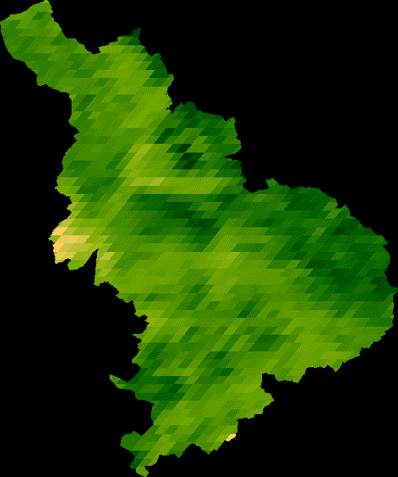

```{r setup, include=FALSE}
knitr::opts_chunk$set(echo = TRUE)
```


```{r}

```


# Set up Google Earth Engine in R

```{r rgee-setup, eval=FALSE}
## load the package
#library(rgee)

## initially run once to set up rgee
#ee_install(py_env = "rgee")

#reticulate::py_install(packages = 'earthengine-api', 
#envname = 'C:/Users/ARVIND/AppData/Local/r-miniconda/envs/rgee')

## check for proper set up for rgee installation and dependencies
#ee_check() # Check non-R dependencies
#ee_clean_credentials() # Remove credentials of a specific user
#ee_clean_pyenv() # Remove reticulate system variables

## Initialize Earth Engine!
#ee_Initialize()

#srtm <- ee$Image("USGS/SRTMGL1_003") 
```

# Precipitation from TerraClimate

```{r}
library(rgee)
library(sf)
library(tidyverse)

ee_Initialize()

## read the boundary for MHWLS (area of interest)
mwls <- st_read("data/elev_band.gpkg") |> sf_as_ee()

## Map each image from 2019 to extract the monthly precipitation (Pr)
terraclimate <- ee$ImageCollection("IDAHO_EPSCOR/TERRACLIMATE") |>
  
  ## filter date
  ee$ImageCollection$filterDate("2019-01-01", "2020-01-01") |>
  
  ## Select only precipitation bands
  ee$ImageCollection$map(function(x) x$select("pr")) |> 
  
  ## from imagecollection to image
  ee$ImageCollection$toBands()
  
  ## rename the bands of an image
  #ee$Image$rename(sprintf("PP_%02d", 1:12))

## extract precipitation values for area of interest
ee_mwls_rain <- ee_extract(x = terraclimate, y = mwls, sf = FALSE)


ee_mwls_rain |>
  pivot_longer(-c(1:2), names_to = "date", values_to = "pr") |>
  mutate(date = gsub("_pr", "", date)) |>
  mutate(date = gsub("X", "", date)) |>
  mutate(year = substr(date, 1, 4), month = substr(date, 5, 6)) |>
  mutate(date = paste(year, month, "01", sep = "-")) |>
  ggplot(aes(x = as.Date(date), y = pr, group = elev_zone, color = elev_zone)) +
  geom_line(alpha = 0.4, lwd = 1) +
  scale_color_discrete(name = "Elevation (m)") +
  #facet_wrap(.~elev_zone) +
  xlab("Time") +
  ylab("Precipitation (mm)") +
  theme_bw() #+
  #theme(legend.position = c(0.85, 0.25))

rm(list = ls())
```

# NDVI animation from MODIS

```{r eval=FALSE}
## Define the regional bounds of animation frames and a mask to clip the NDVI data by.
pkl <- st_read("data/Panchkula.gpkg") |> sf_as_ee()
region <- pkl$geometry()$bounds()

## Retrieve the MODIS Terra Vegetation Indices 16-Day Global 1km dataset as 
## an ee.ImageCollection and select the NDVI band.
col <- ee$ImageCollection('MODIS/006/MOD13A2')$select('NDVI')

## Group images by composite date
col <- col$map(function(img) {
  doy <- ee$Date(img$get('system:time_start'))$getRelative('day', 'year')
  img$set('doy', doy)
})
distinctDOY <- col$filterDate('2019-01-01', '2020-01-01')

## Define a filter that identifies which images from the complete collection
## match the DOY from the distinct DOY collection.
filter <- ee$Filter$equals(leftField = 'doy', rightField = 'doy')

## Define a join; convert the resulting FeatureCollection to an ImageCollection.
join <- ee$Join$saveAll('doy_matches')
joinCol <- ee$ImageCollection(join$apply(distinctDOY, col, filter))


## Apply median reduction among matching DOY collections.
comp <- joinCol$map(function(img) {
  doyCol = ee$ImageCollection$fromImages(
    img$get('doy_matches')
  )
  doyCol$reduce(ee$Reducer$median())
})

## Define RGB visualization parameters.
visParams = list(
  min = 0.0,
  max = 9000.0,
  bands = "NDVI_median",
  palette = c(
    'FFFFFF', 'CE7E45', 'DF923D', 'F1B555', 'FCD163', '99B718', '74A901',
    '66A000', '529400', '3E8601', '207401', '056201', '004C00', '023B01',
    '012E01', '011D01', '011301'
  )
)

## Create RGB visualization images for use as animation frames.
rgbVis <- comp$map(function(img) {
  do.call(img$visualize, visParams) |>
    ee$Image$clip(pkl)
})

## Define GIF visualization parameters.
gifParams <- list(
  region = region,
  dimensions = 600,
  crs = 'EPSG:4326',
  framesPerSecond = 10
)

## Get month names
dates_modis_mabbr <- distinctDOY |>
  ee_get_date_ic() |> # Get Image Collection dates
  select(time_start) |> # Select time_start column
  # Get the month component of the datetime
  mutate(month = lubridate::month(as.POSIXlt(x = time_start, format="%Y-%m-%d"))) |> 
  mutate(months = month.abb[month]) |>
  select(months)

# url for animation
print(rgbVis$getVideoThumbURL(gifParams))
```

```{r}

```

# Acknowledgements

* https://csaybar.github.io/rgee-examples/
* https://r-spatial.github.io/rgee/
