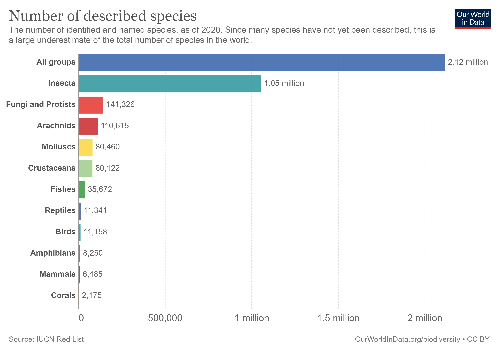
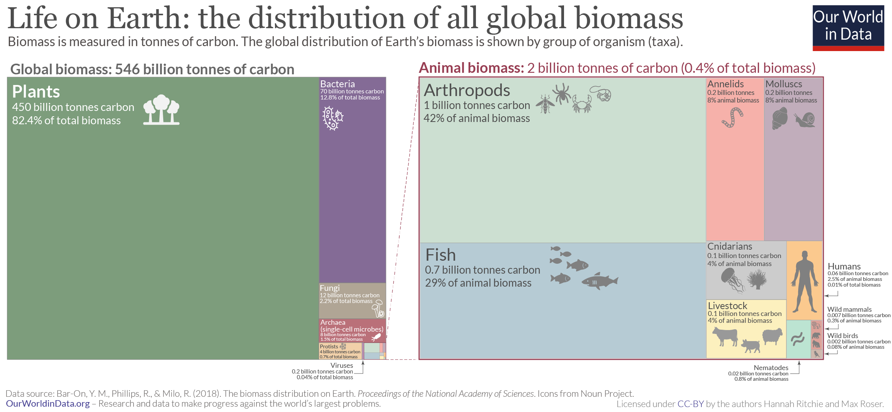
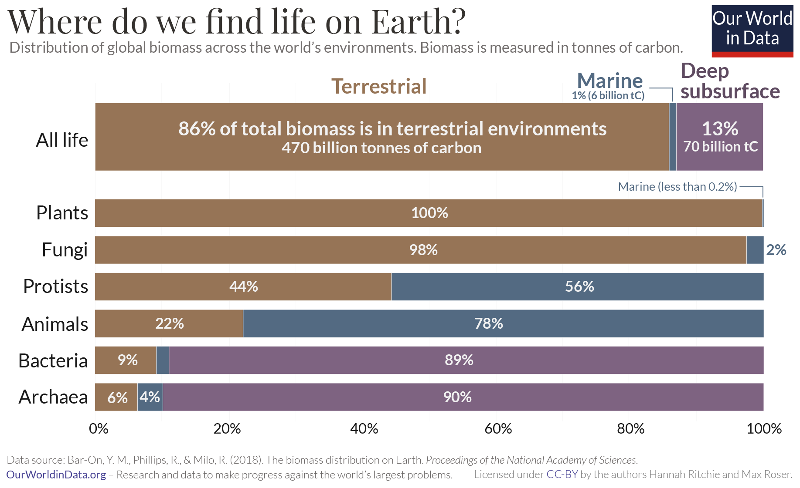
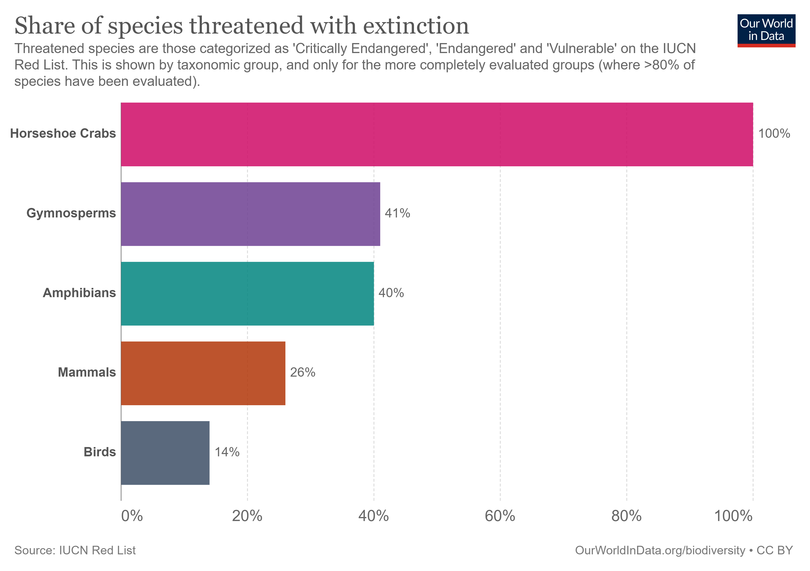
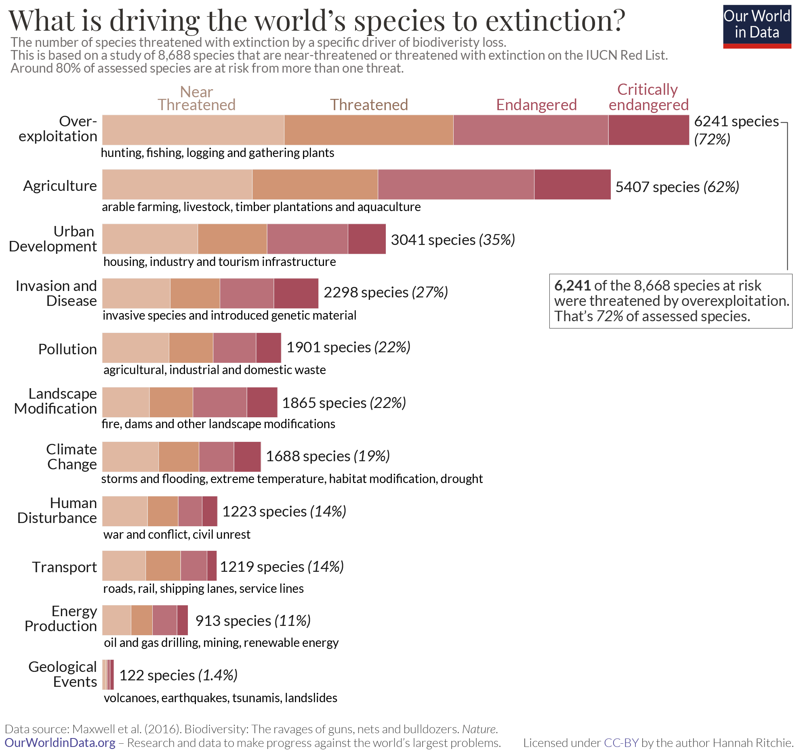
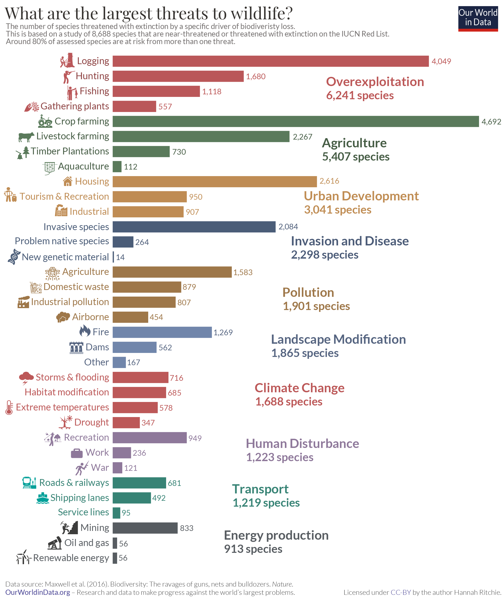

```{r setup, include=FALSE}
knitr::opts_chunk$set(echo = FALSE)
```

## Introduction

Earth is shared by a enormous variety of living organisms distributed across diverse habitats of various scales. The sum total of all forms of life at all scales is referred as biological diversity (or biodiversity). The [Convention on Biological Diversity (CBD)](https://www.cbd.int/) in Article 2 defines "biological diversity" as:

> “the variability among living organisms from all sources, including, ‘inter alia’, terrestrial, marine and other aquatic ecosystems and the ecological complexes of which they are part: this includes diversity within species, between species and of ecosystems [@CBD1992]”

However, this comprehensive definition of biodiversity makes it difficult to quantify or measure all biodiversity of planet with a single metric. 

## How many species we know?

https://data.catalogueoflife.org/dataset/2366/release-metrics

The [IUCN Red List](https://www.iucnredlist.org/) tracks the number of described species and updates this figure annually based on the latest work of taxonomists. In 2020, it listed 2.12 million species on the planet. the chart we see the breakdown across a range of taxonomic groups – 1.05 million insects; over 11,000 birds; over 11,000 reptiles; and over 6,000 mammals.

```{r out.extra="class=external"}

```

These figures – particularly for lesser-known groups such as plants or fungi – might be a bit too high. This is because some described species end up being synonyms – the description of already-known species, simply given a separate name [@Costello2013]. There is a continual evaluation process to remove synonyms (and most are removed eventually), but often species are added at a faster rate than synonyms can be found and removed [@Solow1995]. Around 20% of the described species were undiscovered synonyms [@Costello2013]. Costello et al. [-@Costello2013] estimated that the 1.9 million described species at the time was actually closer to 1.5 million unique species.

According to [Catalogue of Life](https://data.catalogueoflife.org/dataset/2366/release-metrics), only about 2.3 million living species and 1.1 million extinct species have been catalogued till December 2021 [@COL2021]. This suggests that about 80% of existing species on Earth and 90% of species in the ocean still await description [@Mora2011].

## How many species are there?

It’s almost unthinkable that we would not know, or at least have a good estimate, what this number is. But the truth is that it’s a question that continues to escape the world’s taxonomists. The total number of eukaryotic species is estimated around 5-10 million varying hugely from as low as 3 million to over 100 million [@May2010]. Over decades, researchers have made a number of wide-ranging estimates. According to the most widely-accepted estimate, about 8.7 million (±1.3 million SE) eukaryotic species exist globally, of which ∼2.2 million (±0.18 million SE) are marine [@Mora2011].

```{r}
library(dplyr)
library(gt)
rbind(
  c("Animals",	7770000,	2150000,	5620000),
  c("Chromists",	27500,	7400,	20100),
  c("Fungi",		611000,	5320,	605680),
  c("Plants",		298000,	16600,	281400),
  c("Protozoa",		36400,	36400,	0),
  c("Archaea",		455,	1,	454),
  c("Bacteria",		9680,	1320,	8360),
  c("Total species",		8750000,	2210000,	6540000)
) |>
  as.data.frame() |>
  mutate(V2 = as.integer(V2), V3 = as.integer(V3), V4 = as.integer(V4)) |>
  rename("Kingdom" = V1, "Total" = V2,	"Ocean" = V3,
         "Terrestrial" = V4) |>
  gt::gt(caption = "Number of estimated Species") |>
  fmt_number(2:4, drop_trailing_zeros = T) |>
  tab_source_note(md("Source: *Mora et al.* ([2011](https://doi.org/10.1371/journal.pbio.1001127))"))
```

There are also a range of other estimates: Costello et al. [-@Costello2013] estimate 5 ± 3 million species; Chapman [-@Chapman2009] estimates 11 million; and after reviewing the range in the literature, Scheffers et al. [-@Scheffers2012] choose not to give a concrete figure at all. There is typically strong agreement on the most well-studied taxonomic groups such as mammals, birds, and reptiles. Where most of the disagreement lies is in insects, fungi, and other smaller microbial species. Reaching consensus on such small and inaccessible lifeforms is undoubtedly hard.

The total number of eukaryotic species is estimated around 5-10 million varying hugely from as low as 3 million to over 100 million .

The honest answer to the question, “how many species are there?” is that we don’t really know. Some estimates span several orders of magnitude, from a few to 100 million. But most recent estimates lie somewhere in the range of around 5 to 10 million.


```{r out.extra="class=external"}

```

```{r out.extra="class=external"}

```


## How many species are threatened?

The IUCN Red List measures the pressures acting on species, which guides and informs conservation actions to help prevent extinctions. To date, more than 142,500 species have been assessed for the Red List.

```{r out.extra="class=external"}

```

40% of the world’s amphibians; one-quarter of its mammals; and 14% of its birds are threatened with extinction. Many more species in less-studied groups such as insects, fish, fungi and plants are also at risk.

If we want to save these species we first need to know what’s driving them to extinction. 

## What are the largest threats to biodiversity?

```{r}
rbind(
  c("Residential & commercial development", 20474),
  c("Agriculture & aquaculture", 40689),
  c("Energy production & mining", 11399),
  c("Transportation & service corridors", 6141),
  c("Biological resource use", 38772),
  c("Human intrusions & disturbance", 5502),
  c("Natural system modifications", 20329),
  c("Invasive and other problematic species, genes & diseases", 14105),
  c("Pollution",  12915),
  c("Geological events",  1031),
  c("Climate change & severe weather",  11475),
  c("Other options",  533)
) |>
  as.data.frame() |>
  dplyr::mutate(V2 = as.numeric(V2)) |>
  dplyr::rename(c("Threat" = V1, "Species" = V2)) |>
  dplyr::arrange(desc(Species)) |>
  gt::gt(caption = "Major threats to Species") |>
  fmt_number(2, drop_trailing_zeros = T) |>
    tab_source_note(md("Source: *IUCN Red List* ([2021](https://www.iucnredlist.org/search/stats))"))
  
```

```{r out.extra="class=external"}

```

```{r out.extra="class=external"}

```


## Status in India


## Challenges and Opportunities


